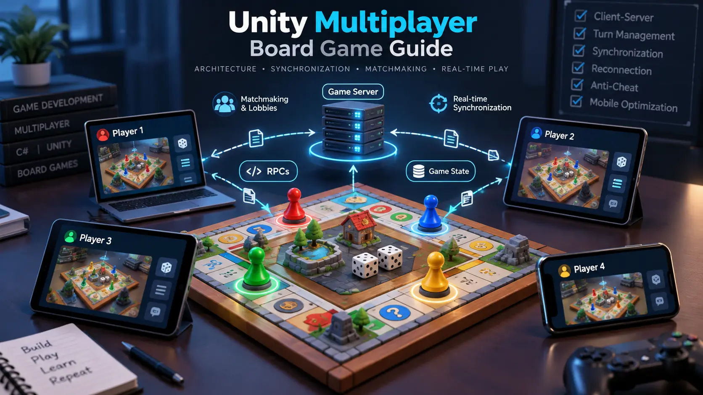

# Unity Multiplayer Board Game Guide

A practical technical guide to building multiplayer board games with Unity.

This repository covers multiplayer architecture, client-server communication,
game-state synchronization, turn management, RPCs, matchmaking, reconnection,
server authority, and mobile optimization.

## 📚 What You'll Learn

- Client-server vs peer-to-peer architecture
- Multiplayer game-state synchronization
- RPCs and NetworkVariables
- Turn-based networking
- Matchmaking and lobby systems
- Player reconnection handling
- Server-authoritative game logic
- Multiplayer anti-cheat fundamentals
- Mobile multiplayer optimization
- Multiplayer testing strategies

## 📖 Complete Technical Guide

For a detailed explanation of how these systems work together in real Unity
board games, read:

👉 **[How Multiplayer Works in Unity Board Games: A Technical Overview](https://unitysourcecode.net/blog/multiplayer-works-in-unity-board-games)**

The article covers client-server architecture, synchronization techniques,
matchmaking, reconnection, anti-cheat, networking solutions, and
cross-platform considerations.

## 🔗 Related Unity Resources

### 📱 Mobile Optimization

If your multiplayer board game targets Android or iOS, performance optimization
is important for maintaining stable gameplay on lower-end devices.

👉 **[Unity Mobile Optimization Guide](https://github.com/unitysourcecode2026/unity-mobile-optimization-guide)**

### ⚡ Low-End Android Optimization

For more detailed optimization techniques covering memory usage, draw calls,
texture compression, object pooling, shaders, and profiling:

👉 **[Unity Low-End Android Optimization Guide](https://github.com/unitysourcecode2026/unity-low-end-android-optimization-guide)**

### 🧩 ScriptableObject Architecture

ScriptableObjects can be useful for organizing reusable game data and
configuration in scalable Unity projects.

👉 **[Unity ScriptableObject Examples](https://github.com/unitysourcecode2026/unity-scriptableobject-examples)**

## 🌐 More Unity Development Resources

Explore Unity game development tutorials, source code projects, and practical
development resources:

👉 **[Unity Source Code](https://unitysourcecode.net/)**

## 📄 License

MIT License
